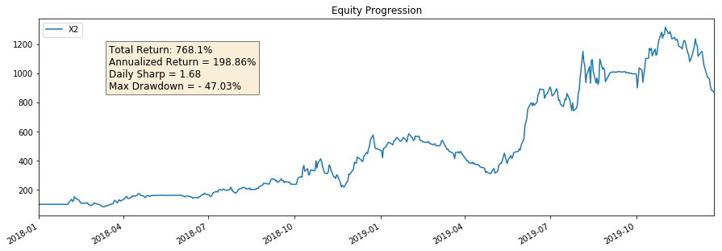
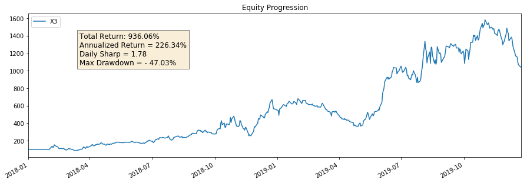
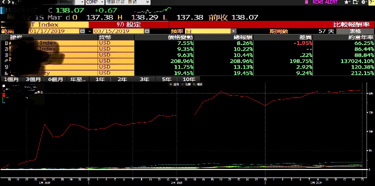

# pyFolio
## Content
- use python 2.7
- attribution analysis of excess returns
- portfolio construction
## Your Support
- You can contribute to the project by reporting bugs, suggesting enhancements, exchanging portfolio management experiences or
you can make a donation to this project:

***
### StrBeta

### Str01
- CAGR(annualized return): approx. 25%
- MDD: approx. -12%
- Sharpe Ratio: >1.5-1.8

** returns should be higher/lower since some days are missing from the data

| DATE | MSCI World | Port_01 | Port_02 |
| --- | --- | --- | --- |
| TOTAL RETURN | 3.16% | 6.60% | 5.75% |
| EXCESS RETURN | n/a | 3.44% | 2.59% |
| # OF HOLDINGS | 1,632 | <100 | <100 |
| 20190320 | 0% | 1.29% | 1.29% |
| 20190321 | 0.75% | 0.90% | 0.90% |
| 20190325 | -1.56% | -1.98% | -1.05% |
| 20190326 | -0.37% | -0.07% | 0.10% |
| 20190327 | 0.75% | 0.09% | 0.53% |
| 20190329 | 0.06% | 0.02% | 0.06% |
| 20190401 | 0.60% | 0.62% | 0.76% | 
| 20190409 | 1.14% | 1.38% | 0.63% | 
| 20190415 | 0.55% | 0.57% | 0.43% | 
| 20190416 | 0.08% | 0.22% | 0.32% | 
| 20190417 | 0.09% | 0.03% | -0.35% | 
| 20190423 | 0.06% | 0.75% | 0.23% | 
| 20190429 | 0.39% | 1.05% | 0.58% | 
| 20190503 | -0.41% | -0.41% | -0.27% | 
| 20190513 | 0.33% | 0.11% | 0.61% | 
| 20190516 | 0.55% | 2.03% | 1.01% | 

### Sectors(ciphered)
B41211
B4129
B41225
B41221
B41222
B41216
B4123
### Holdings(ciphered)
A455
D2111
4
A11612
A319620
B2
B1
B11416
A31313
A132614
H4
A334
A01410
A665
B1148
A67
A115
A6516
F2
G15157
G1515712

***

### Stra02
- Compound Return 2009-2017 / Index High Dividend Growth

| YEAR | TOP TEN | TOPIX | ALPHA | WINNER |
| --- | --- | --- | --- | --- |
| 2009-2010 | n/a | n/a | n/a | n/a |
| 2010-2011 | -6.17% | -9.83% | 3.66% | Top Ten |
| 2011-2012 | 15.03% | 1.37% | 13.66% | Top Ten |
| 2012-2013 | 17.46% | 23.66% | -6.20% | TOPIX |
| 2013-2014 | 15.67% | 2.58% | -6.91% | TOPIX |
| 2014-2015 | 37.19% | 30.54% | 6.65% | Top Ten |
| 2015-2016 | -3.68% | -10.07% | 6.39% | Top Ten |
| 2016-2017 | 33.39% | 18.80% | 14.59% | Top Ten |
| 2017-2018 | 34.93% | 15.33% | 19.60% | Top Ten |
|  |  |  |  |  |
| 2010-2015 | 86.71% | 74.09% | 12.62% | Top Ten |
| 2011-2016 | 91.88% | 73.38% | 18.50% | Top Ten |
| 2012-2017 | 117.73% | 95.86% | 21.87% | Top Ten |
|  |  |  |  |  |
| 2009-2017 | 212.92% | 103.61% | 109.31% | Top Ten |

***

### Analyst Journey 2017-
- Performed fundamental analysis of Emerging (EM) and Developed (DM) markets, focusing on utilities, energy sectors, indices, and multi-assets. Through bottom-up research, uncovered an undervalued electricity stock, recommending an overweight to the benchmark. The stock surged by over 391% in 2 months (initiated Jan 16, 2019). Keywords: chapter 11, chapter 7, list of fires history.
- 
